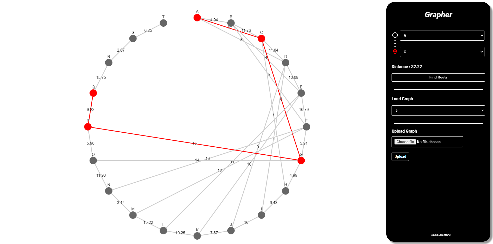

# Grapher

### Description
This project is a simple graph viewer implementation in Java. It uses the Java Spring framework to serve a REST API and a Thymeleaf (server-side Java template engine) frontend to display the graph. 
The graph is stored in a PostgreSQL database using Hibernate ORM and is updated in real-time when the user uploads or deletes JSON formated graphs. 
The user can also search for the shortest path between two given nodes in the graph using Dijkstra's shortest path algorithm. 
The graph is displayed using the [cytoscape.js](https://js.cytoscape.org/) library.

### Technologies
- Java (Spring Maven)
- HTML (Thymeleaf)
- JavaScript (cytoscape.js)
- PostgreSQL
- Hibernate ORM
- Docker

### How to run
1. Clone the repository.
2. Run the 'compose.yaml' file in order to set up the PostgreSQL database.
3. Run the 'GrapherApplication.java' file to start the Spring server.
4. Go to 'http://localhost:8080/' in your browser to access the graph viewer.

### Screenshots

